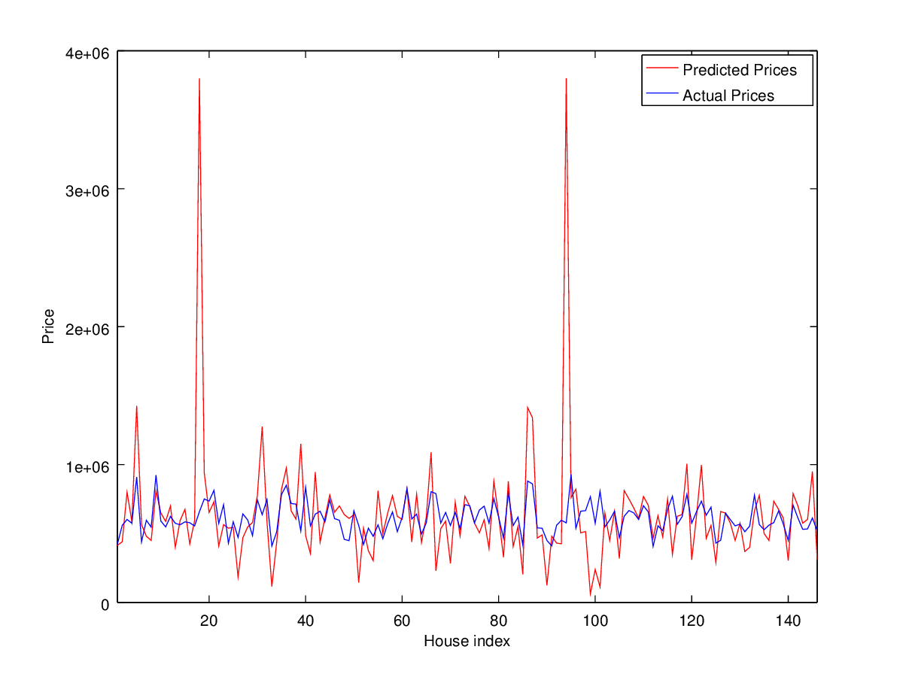

appraiser
=========

A data project to see if we can predict housing prices in select areas of the Bay Area

Predictions
-----------
For what I now realize is a very hard problem with tons of variable inputs and
human subjection involved I'm actually pretty pleased with my results.

I learned

 * How to architect a data gathering service
 * Basics of feature engineering
 * Fun ways to get around API rate limiting
 * Network sleuthing to find undocumented APIs

All in all it was a fun project. Here are my results of a 141 member training set.

Why Finished?
-------------
I feel like I accomplished my original goal, which was to create an introductory
machine learning project. When I realized how much more work I would need to do
to actually get the project into working state I chafed at putting multiple months
of time into developing a richer feature set. This was only meant to be a several week
project but it expanded into a 3 week one. Also I am interested in taking another class
on this subject so I don't think I have time to fully complete this project. Maybe
I will pick this up later. This work surely isn't going anywhere.

Take Aways
----------

 * It's really easy to craft an architecture that can be limiting to your overall project
   Gather all your data, store it somewhere (in unadulterated form), and then filter/modify it.
   Do not store your data in filtered form. You are just asking to refactor your work.
 * It's hard to engineer features. With something like housing prices you have so many variables
   some which are difficult to discern from a machines perspective. For example is the house near
   a highway or in a dilapidated industrial area, well we don't necessarily know that and it is
   hard to tell from the basic data given to us through zillow. Complete feature representation
   for homes at least should probably come from a variety of sources, not the least user surveys
   about an area.
 * You can have a bunch of data but if your model is insufficient then adding more data won't 
   really help your problem of having a high error.
